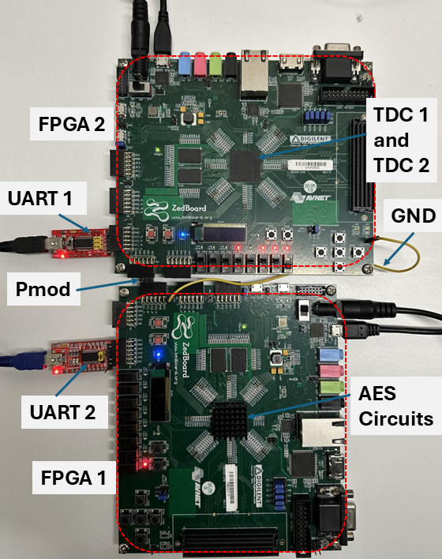
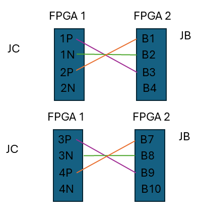
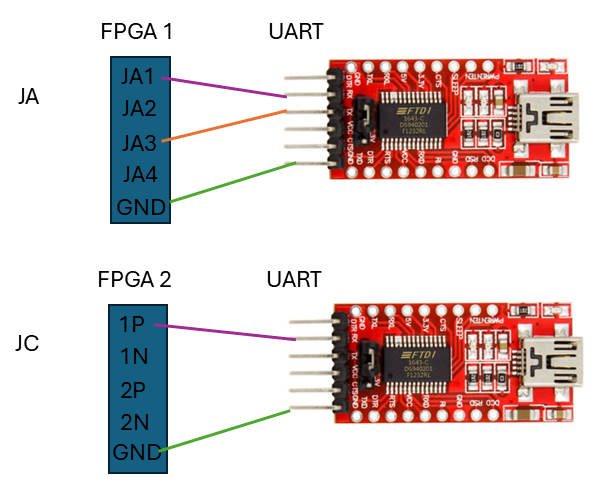

# JitFilt-PLL
 JitFilt-PLL Implementation


## How to Configure FTDI Serial Modules. 
We used FTDI 232RL UARTs. Other UARTs may be compatible. 
							
The serial numbers of FTDI UARTs must be used in the JitFilt_UART_Checker C# program

	JitFilt_UART_Checker
		|
    	|_____ JitFilt_UART_Checker 
               |
               |_____Program.cs               
						-static string FPGA1_FTDI_SERIAL_NUMBER= "A50285BI";  // change this to your FTDI NUMBER
						-static string FPGA2_FTDI_SERIAL_NUMBER = "AD0JIHIL";  // change this to your FTDI NUMBER
							

## FPGA 1 and FPGA 2 Connections


 
### Pmod Connections 




## FPGA and FTDI 232RL Connections



## Collect Traces using JitFilt_UART_Checker

## CPA Attacks using CUDA 
-Edit  **#define SAMPLES** to reflect the number of traces/ encryptions you collected in **kernel-TDC-KR.cu**

-Compile 

```nvcc -w   kernel-TDC-orig1.cu  helpers.cu  -o kernel-TDC-KR ```

-Run CPA attacks (Change file names)

```./kernel-TDC-KR   datafile.data  data-out.txt  0  ```
